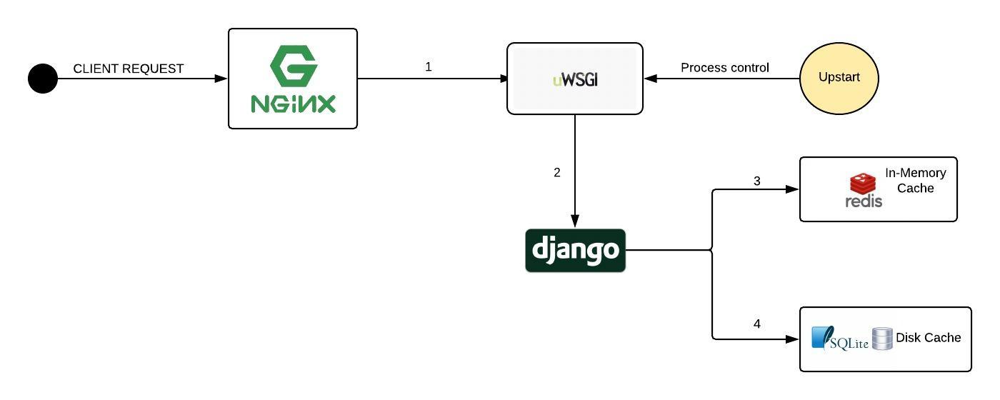
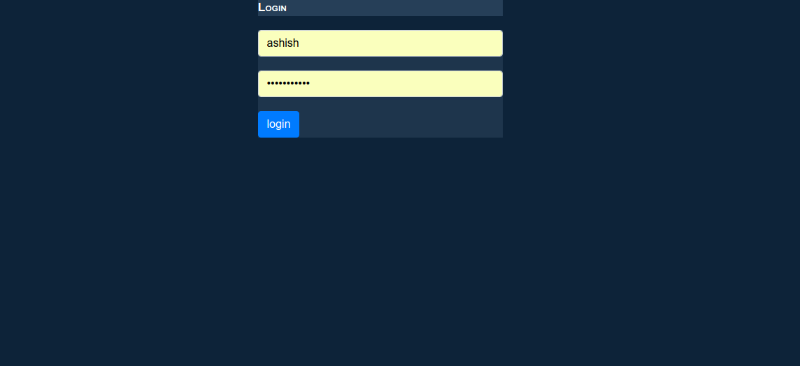
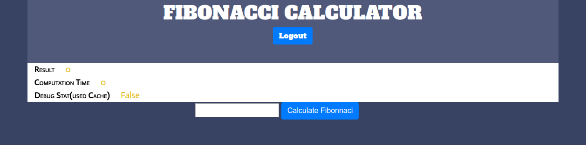
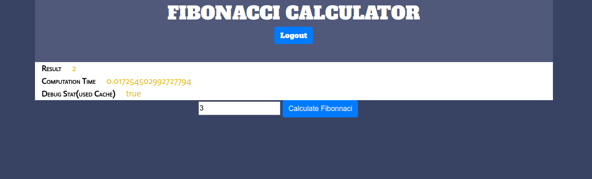

# django-fibonacci

### Architecture

When client issues a request .
1) request is handled by the nginx server which works as a reverse proxy, forwards the request to its upstream (wsgi gateway)
2) uwsgi runs django app that runs djnago & recieves request from its downstream server(nginx).
3) when asking for nth fibonacci number fist a lookup is made in redis , which acts as in-memory cache. If there is a cache hit response is served from this cache.
4) If there was a cache miss in above step lookup is made in disk based cache (sqlite).
5) if steps 4 & 5 fails , the result is computed and sent as response.

### PRODUCT DESCRIPTION

1) for login go to http://139.59.92.166:6878/accounts/login/

  
2) Fill creds & click on submit.

3) Fibonacci calculator page appears after successful login.

4) Fill in the the nth number & click on `Calculate Fibonacci` button

5) The result appears with some stats. 

  stats=>. 
  <b>1) Result</b> : The nth fibonacci number. 
  <b>2) Computation Time</b> : ( Time it took to calculate the result,  NOTE in case of a cache hit , computation time is less as expected). 
  To test if cache is being used or not (enter a random number say `8134` and see the `computation time`, then enter that number again and notice the `computation time`). 
  <b>3) Debug Stat(used Cache)</b> : This field is set to true whenever there was a cache hit(in-memory) , set to false for all cache misses(in-memory). 
  
  
